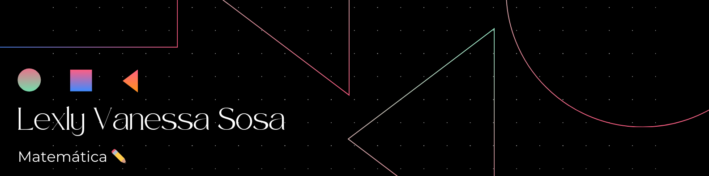

### Hola, Soy Vanessa 👋

Soy matemática graduada de la Universidad Distrital Francisco José de Caldas. 

Tengo interés en trabajar en el sector tecnológico, busco oportunidades que me permitan crecer en el área de análisis de datos. ¡Soy una persona comprometida con el trabajo y la mejora continua!, además, considero fundamental el trabajo en equipo. 💪

A lo largo de mi carrera profesional sentí interes en la inteligencia artificial, razón por la cuál realicé mi trabajo de grado en Redes Neuronales Artificiales.

En el siguiente enlace, puedes encontrar este trabajo de grado:

https://repository.udistrital.edu.co/handle/11349/30489👈

En este repositorio podrás encontrar los proyectos que he ido realizando de forma independiente. Estoy trabajando en proyectos de:

✨ Extracción, limpieza y transformación.
📊 Análisis exploratorio de datos.
💻 Visualización de datos.
👨🏼‍💻 Ciencia de datos.

---------------------------------------------------------------------------------------------------------------

### Hola, Soy Vanessa 👋

Soy matemática graduada de la Universidad Distrital Francisco José de Caldas. 

Tengo interés en trabajar en el sector tecnológico, busco oportunidades que me permitan crecer en el área de análisis de datos. ¡Soy una persona comprometida con el trabajo y la mejora continua!, además, considero fundamental el trabajo en equipo. 💪

A lo largo de mi carrera profesional sentí interes en la inteligencia artificial, razón por la cuál realicé mi trabajo de grado en Redes Neuronales Artificiales.

En el siguiente enlace, puedes encontrar este trabajo de grado:

https://repository.udistrital.edu.co/handle/11349/30489👈

En este repositorio podrás encontrar los proyectos que he ido realizando de forma independiente. Estoy trabajando en proyectos de:

✨ Extracción, limpieza y transformación.
📊 Análisis exploratorio de datos.
💻 Visualización de datos.
👨🏼‍💻 Ciencia de datos.

<!--
**LVanessaS/LVanessaS** is a ✨ _special_ ✨ repository because its `README.md` (this file) appears on your GitHub profile.

Here are some ideas to get you started:

- 🔭 I’m currently working on ...
- 🌱 I’m currently learning ...
- 👯 I’m looking to collaborate on ...
- 🤔 I’m looking for help with ...
- 💬 Ask me about ...
- 📫 How to reach me: ...
- 😄 Pronouns: ...
- ⚡ Fun fact: ...
-->
